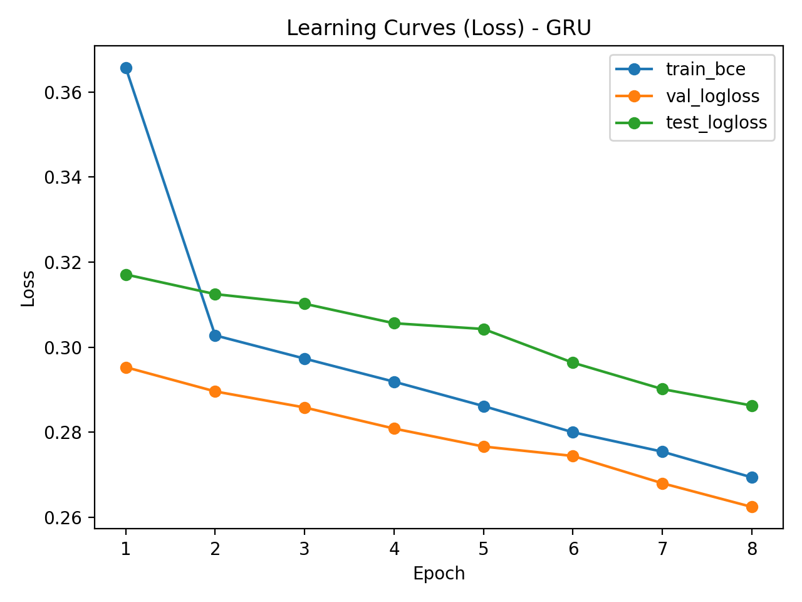
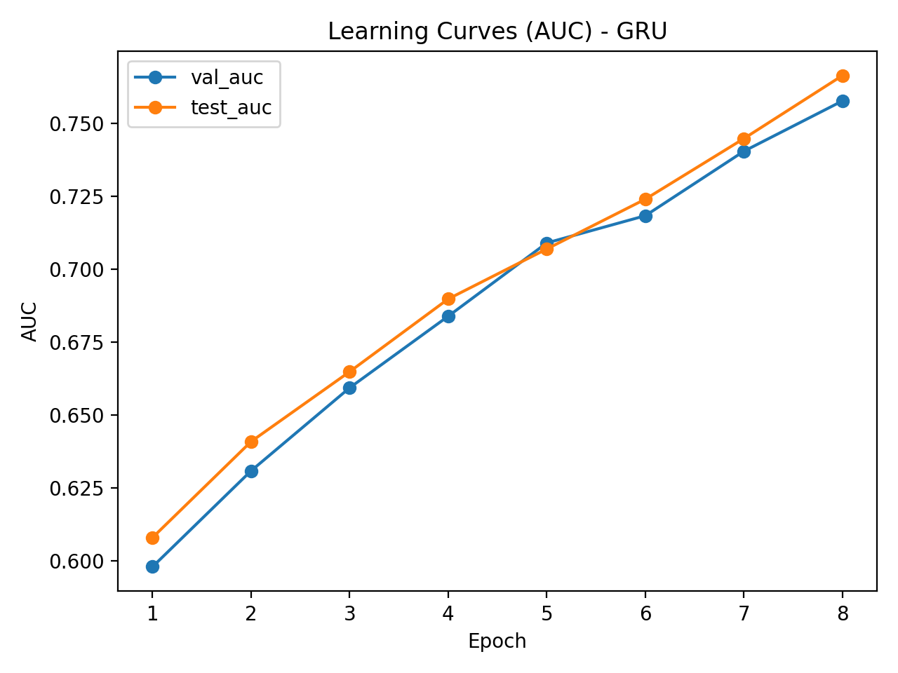
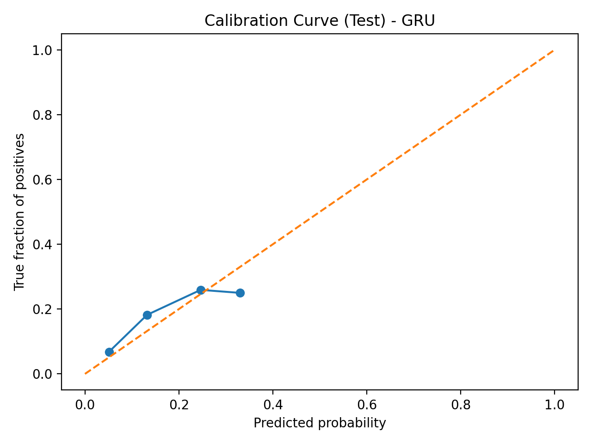
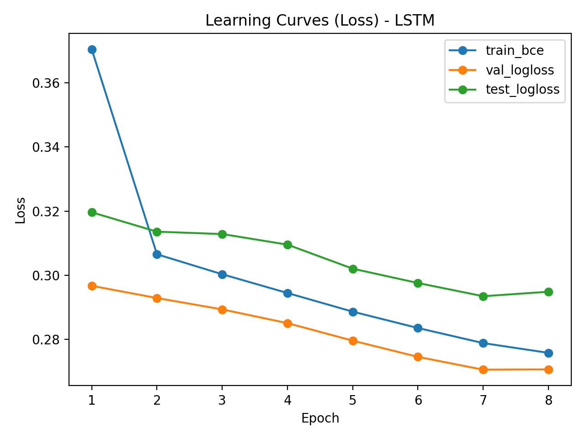
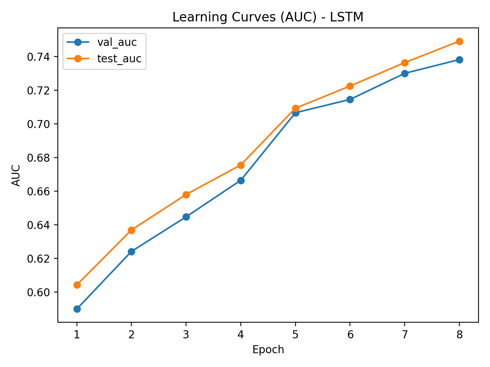
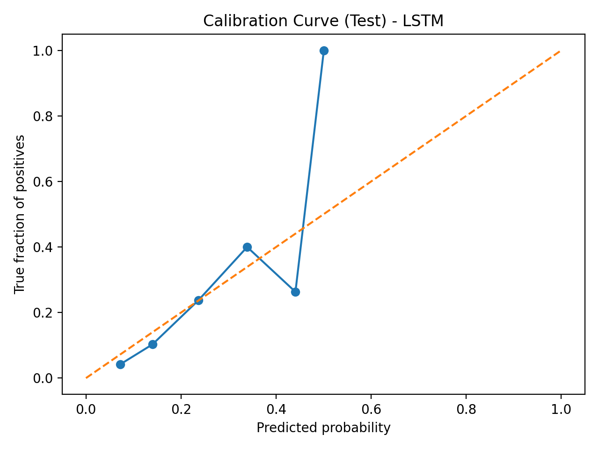

# ⚽ xg-sequence-project — Sequence-aware xG (GRU/LSTM) + Tabular Baseline

[](https://python.org)
[](https://pytorch.org)
[](https://scikit-learn.org)
[](https://statsbomb.com)

Bu proje, futbol şutlarından **gol olasılığı (xG / expected goals)** tahmini yapar.  
Klasik “şut anı özellikleri” yaklaşımına ek olarak, şuttan önceki aksiyonların kısa geçmişini (event sequence) kullanarak **GRU/LSTM tabanlı sequence model** eğitir ve **tabular baseline** ile karşılaştırır.

> Not: Notebook ile yapmak zorunlu değil. Script + modüler `src/` yapısı genelde daha “proje” gibi görünür (tekrar üretilebilirlik ve temiz repo açısından avantaj).

---

## 📌 Özet (Ne yaptım?)
- StatsBomb Open Data’dan maç bazlı **Shot** ve **Event** verilerini çektim.
- Şut için klasik xG belirleyicileri (**mesafe + açı + durum bayrakları**) çıkardım.
- **Tabular baseline**: TF/one-hot tabanlı Logistic Regression + kalibrasyon (isotonic).
- **Sequence model**: Şuttan önceki son `T=10` event’in tip + konum + zaman + takım bilgisini GRU/LSTM ile işledim.
- Model değerlendirmesinde yalnızca skor değil, **kalibrasyonu** da raporladım (**Brier / ECE + calibration curve**).

---

## 🧠 Problem Tanımı ve Motivasyon
xG, bir şutun gol olma olasılığını tahmin ederek takım/oyuncu performans analizinde (şut kalitesi, bitiricilik, oyun planı analizi vb.) yaygın kullanılan bir metriktir.  
Klasik xG modelleri çoğunlukla yalnızca şut anındaki bilgileri (mesafe, açı, baskı vb.) kullanır. Bu projede amaç, şut öncesi oyunun bağlamını daha iyi yakalamak için **şuttan önce gerçekleşen event’lerin kısa geçmişini** (pas, top kazanma, dripling vb.) modele dahil ederek tahmin kalitesini artırmaktır.

---

## 📊 Veri Seti
Veri kaynağı: **StatsBomb Open Data** (`statsbombpy` üzerinden çekilir).

### 1) `data/shots.csv` — Shot verisi (`src/data_make.py`)
- Sadece `type == Shot` event’leri filtrelenir.
- Etiket (target):
  - `is_goal = 1` (shot_outcome == Goal)
  - `is_goal = 0` (diğer durumlar)
- Konum: `location` alanından `x`, `y` çıkarılır.
- Kategorikler: `shot_body_part`, `shot_type`, `team`, `player` alanları “name” formatına dönüştürülür.

> Kullanılan competition/season script çalıştırılırken sorulur:  
> `competition_id=[DOLDUR]`, `season_id=[DOLDUR]`

### 2) `data/events/events_<match_id>.csv` — Event verisi (`src/events_make.py`)
- `shots.csv` içindeki `match_id` listesi çıkarılır.
- Her match için tüm event’ler indirilir ve temel kolonlar saklanır:
  - zaman: `minute`, `second`, `period`, `timestamp`
  - olay: `type`
  - sahiplik: `possession`, `possession_team`
  - konum: `x`, `y` (location’dan çıkarılır)

---

## 🧩 Feature Engineering (`src/features.py`)
### Mesafe + Açı
- `distance`: şut noktasından kaleye (GOAL_X=120, GOAL_Y=40) Öklid mesafesi
- `angle`: iki direk noktasına göre (GOAL_HALF_WIDTH=3.66) şut açısı (radyan)

### Basit bayraklar
- `under_pressure`
- `shot_first_time`
- `shot_one_on_one`
- `shot_aerial_won`

### Koordinat standardizasyonu (opsiyonel)
Bazı veri setlerinde şutlar iki yöne dağılmış olabilir. `maybe_standardize_coords(enable=True)` ile çoğunluk `x<60` ise koordinatlar flip edilerek kalenin `x=120` tarafına standardize edilir.  
Varsayılan güvenli ayar: `enable=False`.

---

## 🧪 Modeller

### 1) Tabular Baseline — `src/train_tabular.py`
- Özellikler: `distance`, `angle`, bayraklar + (shot_body_part, shot_type one-hot)
- **Match bazlı split** (leakage azaltmak için)
- Model:
  - `LogisticRegression(class_weight="balanced")`
  - `CalibratedClassifierCV(method="isotonic", cv=3)`
- Metrikler: `logloss`, `AUC`, `Brier`, `ECE`
- Çıktı: `results/calibration_curve.png`

### 2) Sequence Model (GRU/LSTM) — `src/train_sequence.py` / `src/eval_sequence.py`
Her şut için, şuttan önceki son `T=seq_len` event alınır.

**Her adım girdileri:**
- `type_id` (embedding)
- `x_norm`, `y_norm` (120x80’e normalize)
- `t_norm` (şuta göre zaman farkı normalize)
- `same_team` (event takımı ile şutu atan takım aynı mı?)

**Statik şut özellikleri (6 boyut):**
- `distance` (120’e bölünerek)
- `angle` (pi’ye bölünerek)
- bayraklar (4 adet)

**Model:**
- Embedding + (x,y,t,same_team) → GRU/LSTM
- Mask ile **son geçerli adımın** hidden state’i alınır
- Hidden + statik → MLP head → logit
- Loss: `BCEWithLogitsLoss`, Optim: Adam, grad clip

**Reprodüksiyon / kayıt:**
- `checkpoints/split.json` (train/val/test match listeleri)
- `checkpoints/type_vocab.json` (event type vocab)
- `checkpoints/seq_<gru|lstm>_best.pt`, `checkpoints/seq_<gru|lstm>_last.pt`
- Learning curves: `results/learning_curve_*_<gru|lstm>.png`

---

## ✅ Deneysel Sonuçlar (Test)

### Sequence Model (GRU) — Best Checkpoint
- `test_logloss`: **0.2863**
- `test_auc`: **0.7663**
- `test_brier`: **0.0820**
- `ece_uniform`: **0.0189**
- `ece_quantile_plot`: **0.0227**

### Sequence Model (LSTM) — Best Checkpoint
- `test_logloss`: **0.2935**
- `test_auc`: **0.7365**
- `test_brier`: **0.0833**
- `ece_uniform`: **0.0159**
- `ece_quantile_plot`: **0.0313**

**Kısa yorum:**
- Bu konfigürasyonda **GRU**, LSTM’e göre hem **AUC** hem de **logloss** açısından daha iyi performans verdi.
- Kalibrasyon eğrileri diyagonale yakın; **ECE değerleri düşük** olduğu için olasılık tahminleri genel olarak güvenilir.

> İstersen buraya baseline (LogReg) sonuçlarını da tablo olarak ekleyebilirsin:  
> `test_logloss=[DOLDUR]`, `test_auc=[DOLDUR]`, `test_brier=[DOLDUR]`, `test_ece=[DOLDUR]`

---

## 🖼️ Çıktı Görselleri
Aşağıdaki dosyalar eğitim ve kalibrasyon çıktılarıdır:
- `results/learning_curve_loss_gru.png`
- `results/learning_curve_auc_gru.png`
- `results/calibration_curve_gru.png`
- `results/learning_curve_loss_lstm.png`
- `results/learning_curve_auc_lstm.png`
- `results/calibration_curve_lstm.png`

README içinde önizlemek istersen:
```md







```

---

## 🚀 Kurulum
```bash
pip install -r requirements.txt
```

---

## ▶️ Çalıştırma

### 1) Veri hazırlama
Önce şutları indir:
```bash
python src/data_make.py
```

Sonra bu maçların event’lerini indir:
```bash
python src/events_make.py
```

### 2) Tabular baseline eğitimi
```bash
python src/train_tabular.py
```

### 3) Sequence model eğitimi
GRU/LSTM seçimi `src/train_sequence.py` içinde `SeqConfig(rnn_type="gru" | "lstm")` ile yapılır:
```bash
python src/train_sequence.py
```

### 4) Sequence model test değerlendirme
```bash
python src/eval_sequence.py
```

---

## 📁 Proje Yapısı
```
xg-sequence-project/
├── src/
│   ├── data_make.py
│   ├── events_make.py
│   ├── features.py
│   ├── utils_sb.py
│   ├── train_tabular.py
│   ├── train_sequence.py
│   └── eval_sequence.py
├── data/
│   ├── shots.csv
│   └── events/
├── checkpoints/
│   ├── split.json
│   ├── type_vocab.json
│   ├── seq_gru_best.pt
│   ├── seq_gru_last.pt
│   ├── seq_lstm_best.pt
│   └── seq_lstm_last.pt
├── results/
│   ├── learning_curve_loss_gru.png
│   ├── learning_curve_auc_gru.png
│   ├── calibration_curve_gru.png
│   ├── learning_curve_loss_lstm.png
│   ├── learning_curve_auc_lstm.png
│   └── calibration_curve_lstm.png
├── requirements.txt
└── README.md
```

---

## 🛠️ Sorun Giderme
- **`FutureWarning: Downcasting object dtype arrays...`**  
  Pandas uyarısıdır, çalışmayı bozmaz. İstersen `features.py` içinde `infer_objects(copy=False)` ile tipleri netleştirebilirsin.
- **CUDA yok / yavaş eğitim:**  
  CPU ile çalışır ama yavaş olabilir. `batch_size` düşürmek rahatlatır.
- **Event dosyası yok hatası:**  
  `python src/events_make.py` çalıştığından ve `data/events/events_<match>.csv` dosyalarının oluştuğundan emin ol.

---

## 🔍 Sınırlılıklar ve Gelecek Çalışmalar
- Sınıf dengesizliği (gol az) nedeniyle metrikler hassastır → daha güçlü sampling/weighting denenebilir.
- Daha iyi sequence temsili için event tiplerine ek olarak “topa sahiplik”, “hız/mesafe”, “olay alt tipleri” eklenebilir.
- Kalibrasyon için temperature scaling / Platt scaling gibi alternatifler denenebilir.
- Seq modelde attention (Transformer encoder) ile karşılaştırma eklenebilir.

---

## 👤 Geliştirici
**Ahmet Sami Gül**  
Proje: `xg-sequence-project`
